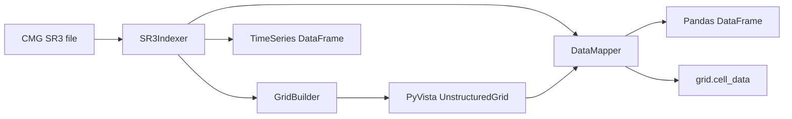
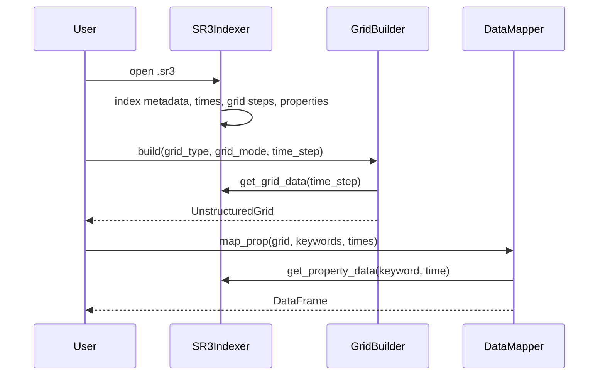

# Architecture

pysr3 follows a three-layer separation of concerns: **access → geometry →
properties**.

## Layer responsibilities

**`SR3Indexer` — access / single source of truth.** Opens the HDF5 file and
indexes time steps, `/SpatialProperties/<step>/GRID`, property arrays, units,
components, and `/TimeSeries`. It returns plain NumPy arrays and pandas
DataFrames — never raw `h5py` objects — so the rest of the package never touches
HDF5 directly.

**`GridBuilder` — geometry.** A thin facade that fetches the grid arrays once and
dispatches to a registered [`GridStrategy`](grid-internals.md). It returns a
PyVista `UnstructuredGrid` with `GlobalCellID`, `PropGlobalID`, `Level`,
`I/J/K`, and `ParentI/J/K` cell data.

The per-family strategies live in the `pysr3/grid/` subpackage:

- `grid/geometry.py` — reusable pure-NumPy helpers (level inference, grid-mode
  filtering, hex/quad assembly, I/J/K and parent-I/J/K, KDIR, active-cell mask).
- `grid/base.py` — the `GridStrategy` ABC and its registry. Adding a grid type
  is additive: write a strategy and register it.
- `grid/cartesian.py`, `corner_point.py`, `radial.py` — one strategy per family.
- `grid/dfn.py` — embedded DFU / DFN-segment surface builders.

A single `infer_levels` implementation (in `grid/geometry.py`) is shared by
`GridBuilder` and `DataMapper`, so LGR level inference can never diverge between
building and mapping.

**`DataMapper` — properties.** Maps SR3 property arrays onto a grid using the
`PropGlobalID` or `GlobalCellID` cell arrays, with optional bottom-up LGR
aggregation. See [Data model & types](data-model.md).

**DFN** is an independent embedded fracture object, not part of the matrix grid
hierarchy. Cases with DFN export fracture surfaces separately via
`build_dfn_units()` and `build_dfn_segments()`.

**TimeSeries** is read directly by `SR3Indexer` into a long-form DataFrame,
covering `WELLS`, `LAYERS`, `GROUPS`, `SECTORS`, and `SPECIAL HISTORY`.

## Data flow

## Stable boundary

Third-party callers should depend on the public API only:

- `SR3Indexer.get_grid_data`, `get_property_data`, `get_available_times`,
  `get_available_properties`, `get_timeseries_entities`, `get_timeseries_info`,
  `get_timeseries_data`, `get_well_data`
- `GridBuilder.build`, `build_dfn_units`, `build_dfn_segments`
- `DataMapper.map_prop`

These are re-exported from the top-level package and listed in
[`pysr3/__init__.py`](../api/index.md). Underscore-prefixed members and the
per-family strategy classes are internal. The package installs via
`pyproject.toml` (`pip install -e .`); runtime dependencies are in
`requirements.txt`.
