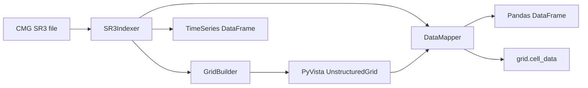
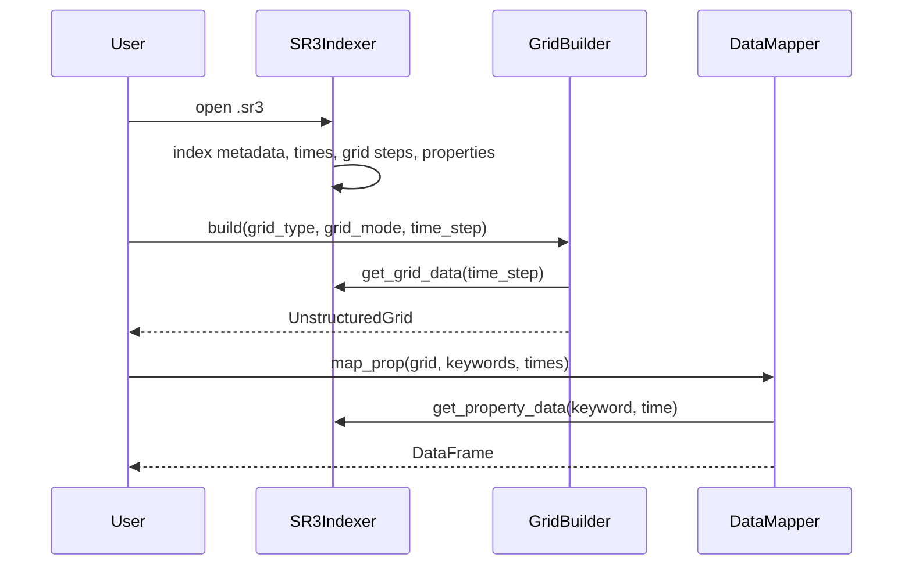

# 架构

pysr3 遵循三层关注点分离原则：**访问层 → 几何层 → 属性层**。

## 各层职责

**`SR3Indexer` — 访问层 / 唯一数据源。** 打开 HDF5 文件并索引时间步、`/SpatialProperties/<step>/GRID`、属性数组、单位、组分以及 `/TimeSeries`。它返回纯 NumPy 数组和 pandas DataFrame，而非原始 `h5py` 对象，因此包内其余部分永远不会直接接触 HDF5。

**`GridBuilder` — 几何层。** 一个轻量级分发层(facade)，一次性获取网格数组，然后分发给已注册的 [`GridStrategy`](grid-internals.md)。返回带有 `GlobalCellID`、`PropGlobalID`、`Level`、`I/J/K` 和 `ParentI/J/K` 单元数据的 PyVista `UnstructuredGrid`。

各网格族的策略位于 `pysr3/grid/` 子包中：

- `grid/geometry.py` — 可复用的纯 NumPy 工具函数（层级推断、网格模式过滤、六/四边形组装、I/J/K 与父 I/J/K、KDIR、活跃单元掩码）。
- `grid/base.py` — `GridStrategy` 抽象基类及其注册表。添加新网格类型是纯增量操作：编写策略并注册即可。
- `grid/cartesian.py`、`corner_point.py`、`radial.py` — 每个网格族对应一个策略。
- `grid/dfn.py` — 嵌入式 DFU / DFN 线段面构建器。

`infer_levels` 的单一实现（位于 `grid/geometry.py`）由 `GridBuilder` 和 `DataMapper` 共享，从而确保构建网格与属性映射时的 LGR 层级推断结果永远不会产生分歧。

**`DataMapper` — 属性层。** 使用 `PropGlobalID` 或 `GlobalCellID` 单元数组将 SR3 属性数组映射到网格，支持可选的自下而上 LGR 聚合。参见[数据模型与类型](data-model.md)。

**DFN** 是独立的嵌入式裂缝对象，不属于矩阵网格层次结构。包含 DFN 的案例通过 `build_dfn_units()` 和 `build_dfn_segments()` 单独导出裂缝面。

**TimeSeries** 由 `SR3Indexer` 直接读取为长格式 DataFrame，涵盖 `WELLS`、`LAYERS`、`GROUPS`、`SECTORS` 和 `SPECIAL HISTORY`。

## 数据流

## 稳定边界

第三方调用方应仅依赖公共 API：

- `SR3Indexer.get_grid_data`、`get_property_data`、`get_available_times`、
  `get_available_properties`、`get_timeseries_entities`、`get_timeseries_info`、
  `get_timeseries_data`、`get_well_data`
- `GridBuilder.build`、`build_dfn_units`、`build_dfn_segments`
- `DataMapper.map_prop`

这些接口均从顶层包重导出，并列于 [`pysr3/__init__.py`](../api/index.md)。下划线前缀的成员以及各族策略类均属内部实现。包通过 `pyproject.toml` 安装（`pip install -e .`）；运行时依赖列于 `requirements.txt`。
