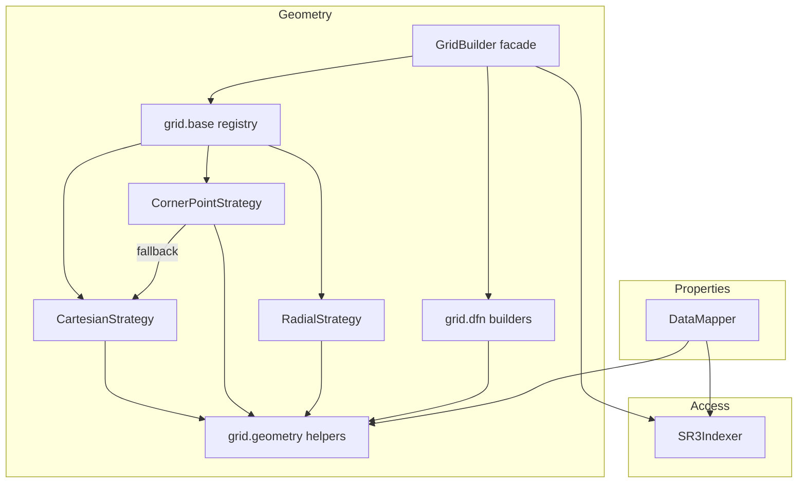

# Component relationships

## Dependency graph



A few relationships worth calling out:

- **`GridBuilder` owns no geometry logic.** It fetches `get_grid_data` once and
  delegates to a strategy resolved from the registry, then merges coincident
  points. This keeps the facade tiny and makes strategies independently testable.
- **`CornerPointStrategy` may delegate to `CartesianStrategy`** when a
  convert-to-corner SR3 emits no corner arrays (e.g. some `DFN_REFINE` cases).
- **`DataMapper` and the strategies share `grid.geometry`.** Both call the same
  `infer_levels`, so the level numbers used to *build* a grid and to *aggregate*
  a property are guaranteed identical.
- **Everything touching HDF5 goes through `SR3Indexer`.** Strategies and
  `DataMapper` receive plain arrays, never a file handle.

## Feature → component → SR3 arrays

| Feature | Entry point | Key SR3 arrays |
|---|---|---|
| Cartesian / VARI grid | `GridBuilder.build("Cartesian")` | `BLOCKSIZE`, `BLOCKDEPTH`, `IGNT*`, `ICSTP*` |
| Radial grid | `GridBuilder.build("Radial")` | `BLOCKSIZE`, `WELLRADIUS`, `IGNT*` |
| CornerPoint grid | `GridBuilder.build("CornerPoint")` | `NODES/BLOCKS` \| `*CORNCRCN` \| `COORD/ZCORN` |
| LGR levels & modes | `grid_mode=` | `IGNTNC`, `ICSTPB` |
| DFU surfaces | `GridBuilder.build_dfn_units()` | `DFUCO*`, `DFUTNL`, `IUTDF` |
| DFN segments | `GridBuilder.build_dfn_segments()` | `SGCOR*`, `ISGTPS`, `IPSTCS` |
| Property mapping | `DataMapper.map_prop()` | `ICSTPS`, property arrays |
| LGR aggregation | `map_prop(..., aggregate=True)` | `ICSTPB`, `IGNTNC` |
| Wells / time series | `SR3Indexer.get_timeseries_data()` | `/TimeSeries/<entity>` |

## Typical call sequence

```python
from pysr3 import SR3Indexer, GridBuilder, DataMapper

with SR3Indexer(path, eager_list_steps=None) as sr3:   # access
    builder = GridBuilder(sr3)                       # geometry facade
    grid = builder.build(grid_type="CornerPoint")    # -> strategy -> geometry helpers
    seg  = builder.build_dfn_segments()              # -> grid.dfn
    df   = DataMapper(sr3).map_prop(grid, "PRES", 0)  # properties
```

See [Grid strategy internals](grid-internals.md) for what happens inside
`build()`, and [Data model & types](data-model.md) for the arrays exchanged.
