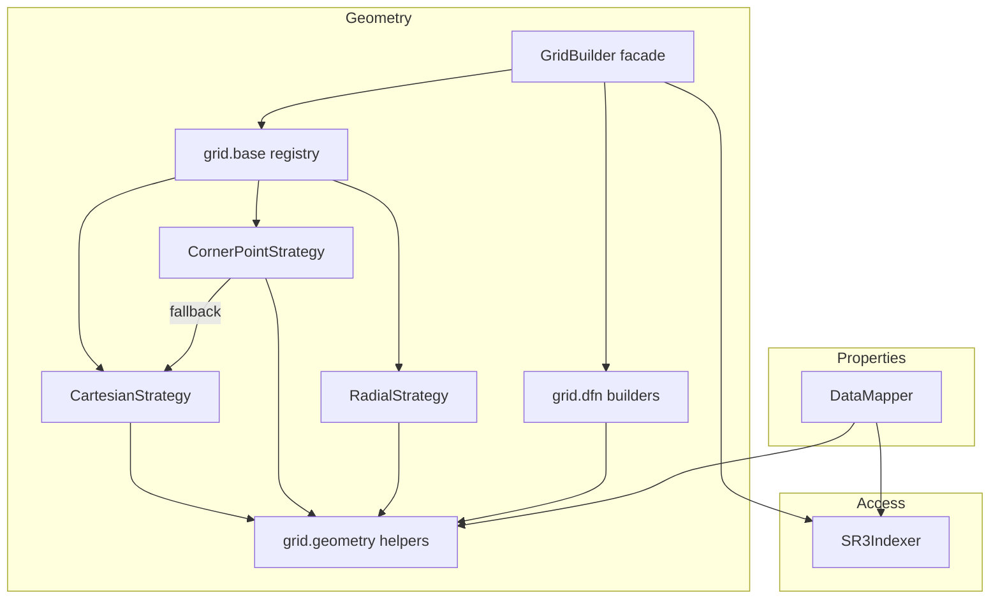

# 组件关系

## 依赖关系图



以下几点关系值得特别说明：

- **`GridBuilder` 不包含任何几何逻辑。** 它一次性获取 `get_grid_data`，将工作委托给从注册表解析出的策略，再合并重合点。这使分发层(facade)保持轻量，也让各策略可独立测试。
- **`CornerPointStrategy` 可能回退至 `CartesianStrategy`**，当某个 convert-to-corner 的 SR3 文件未输出角点数组时（例如部分 `DFN_REFINE` 案例）。
- **`DataMapper` 与各策略共享 `grid.geometry`。** 两者调用同一个 `infer_levels`，因此*构建*网格时和*聚合*属性时所用的层级编号保证完全一致。
- **所有触及 HDF5 的操作均通过 `SR3Indexer` 进行。** 策略和 `DataMapper` 接收的是纯数组，而非文件句柄。

## 功能 → 组件 → SR3 数组

| 功能 | 入口点 | 关键 SR3 数组 |
|---|---|---|
| Cartesian / VARI 网格 | `GridBuilder.build("Cartesian")` | `BLOCKSIZE`、`BLOCKDEPTH`、`IGNT*`、`ICSTP*` |
| 径向网格 | `GridBuilder.build("Radial")` | `BLOCKSIZE`、`WELLRADIUS`、`IGNT*` |
| 角点网格 | `GridBuilder.build("CornerPoint")` | `NODES/BLOCKS` \| `*CORNCRCN` \| `COORD/ZCORN` |
| LGR 层级与模式 | `grid_mode=` | `IGNTNC`、`ICSTPB` |
| DFU 面 | `GridBuilder.build_dfn_units()` | `DFUCO*`、`DFUTNL`、`IUTDF` |
| DFN 线段 | `GridBuilder.build_dfn_segments()` | `SGCOR*`、`ISGTPS`、`IPSTCS` |
| 属性映射 | `DataMapper.map_prop()` | `ICSTPS`、属性数组 |
| LGR 聚合 | `map_prop(..., aggregate=True)` | `ICSTPB`、`IGNTNC` |
| 井 / 时间序列 | `SR3Indexer.get_timeseries_data()` | `/TimeSeries/<entity>` |

## 典型调用序列

```python
from sr3kit import SR3Indexer, GridBuilder, DataMapper

with SR3Indexer(path, eager_list_steps=None) as sr3:   # access
    builder = GridBuilder(sr3)                       # geometry facade
    grid = builder.build(grid_type="CornerPoint")    # -> strategy -> geometry helpers
    seg  = builder.build_dfn_segments()              # -> grid.dfn
    df   = DataMapper(sr3).map_prop(grid, "PRES", 0)  # properties
```

关于 `build()` 内部发生的事情，请参见[网格策略内部机制](grid-internals.md)；关于各层之间交换的数组，请参见[数据模型与类型](data-model.md)。
