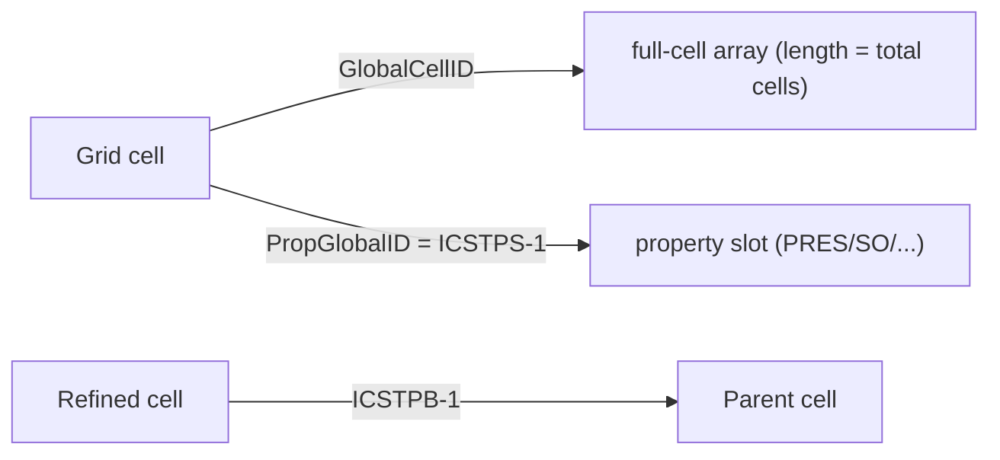

# Data model & types

This page defines the identifiers and arrays that flow between the layers, and
the SR3 arrays they derive from.

## The two cell keys

Property mapping rests on a deliberate separation of **which value** from
**which cell**:

| Key | Definition | Indexes into |
|---|---|---|
| `PropGlobalID` | `ICSTPS - 1` | a spatial-property array (`PRES`, `SO`, …) |
| `GlobalCellID` | 0-based linear cell index in the SR3 file | the full per-cell array (used for LGR aggregation) |

`DataMapper` uses `PropGlobalID` for direct mapping (fast, leaf-only grids) and
`GlobalCellID` for aggregated mapping (it builds a full-cell array, rolls
children into parents via `ICSTPB`, then indexes by `GlobalCellID`). Inactive
cells have `PropGlobalID == -1` and map to `NaN`.

## Matrix grid cell data

Arrays stamped on every matrix `UnstructuredGrid`:

| Array | dtype | Meaning |
|---|---|---|
| `PropGlobalID` | int32 | property-slot index (`ICSTPS-1`); `-1` ⇒ inactive |
| `GlobalCellID` | int | 0-based linear cell index |
| `Level` | int16 | LGR level (0 = base grid) |
| `I`, `J`, `K` | int32 | local structured indices within the cell's segment |
| `ParentI/J/K` | int32 | parent cell's I/J/K (refined cells); `-1` at level 0 |

## DFN cell data

`build_dfn_segments()` returns QUAD surfaces with:

| Array | Meaning |
|---|---|
| `PropGlobalID` | property slot (`ISGTPS-1`) — lets you map `PRES`/`SO`/… onto segments |
| `DFNSegmentID` | original segment index |
| `DFUIndex` | the DFU the segment belongs to (`ISGTDU-1`) |
| `HostGlobalCellID` | the matrix cell hosting the segment (`IPSTCS-1`) |
| `HostI/J/K` | the host cell's structured indices |
| `SegmentInHost` | segment ordinal within the host (`IPSTSG`) |

`build_dfn_units()` returns the original DFU quads with `DFUIndex`,
`DFUNodeEnd`, `DFNIndex`, and (when present) `DFUAPT` and `DFUPERM`.

## SR3 array glossary

`SR3Indexer.get_grid_data(step)` returns a dict of these raw arrays (those
present depend on the grid type):

### Structure & geometry

| Array | Role |
|---|---|
| `IGNTID`, `IGNTJD`, `IGNTKD` | per-segment NI, NJ, NK dimensions (NRT: "Grid number to no. of I/J/K direction blocks") |
| `IGNTNC` | cumulative cell-count offsets that delimit segments. NRT calls it "Grid number to last block CS index" — `IGNTNC[g]` is the exclusive end CS index of grid `g-1`, so `diff(IGNTNC)` gives per-grid cell counts |
| `IGNTGT` | per-grid type code (`1=Cartesian`, `2=Radial`, `3=LGR sub-grid`, `12=CornerPoint`). `IGNTGT[0]` is the root grid's type — used by `GridBuilder` to auto-detect |
| `BLOCKSIZE` | per-cell (Δx, Δy, Δz); for radial, (Δr, arc length, Δz) |
| `BLOCKDEPTH` | per-cell centre depth (positive downward) |
| `BLOCKPVOL` | per-cell pore volume (NRT: "Block pore volume", dim 5 = Property Volume; the rock volume that holds fluids — bulk × porosity × NTG) |
| `WELLRADIUS` | inner radius per radial segment |
| `KDIR` | layer direction (`UP`/`DOWN`) |

### Cell ↔ property ↔ parent

| Array | Role |
|---|---|
| `ICSTPS` | geometry cell → property slot (`PropGlobalID = ICSTPS-1`); NRT: "Complete storage to packed storage" |
| `ICSTPB` | parent pointer (1-based) used to infer `Level` and aggregate LGR; NRT: "Complete storage to parent block" |
| `ICSTCG` | inverse of `ICSTPB`: per-cell child-grid pointer (1-based), nonzero only on refined-parent cells; NRT: "Complete storage to child grid" |
| `ICSTGN` | per-cell grid number (1-based); NRT: "Complete storage to grid number" — equivalent to `1 + np.searchsorted(IGNTNC[1:], np.arange(n), side='right')` |
| `IPSTAC` | active flag per property slot (a null-layer host can be inactive); NRT: "Packed storage to active status" |

### Corner-point encodings

| Arrays | Encoding |
|---|---|
| `NODES`, `BLOCKS` | explicit nodes + connectivity |
| `XCORNCRCN`, `YCORNCRCN`, `ZCORNCRCN` | compressed structured corners |
| `COORD`, `ZCORN` | Eclipse-style pillar grid |

### DFN

| Arrays | Role |
|---|---|
| `DFUCOX/Y/Z`, `DFUTNL`, `IUTDF` | original DFU quads, node ranges, DFN index |
| `SGCORX/Y/Z`, `ISGTPS` | embedded segment quads + property slots |
| `ISGTDU`, `IPSTCS`, `IPSTSG` | segment → DFU, → host cell, → ordinal in host |

!!! note "Active cells"
    `active_cell_mask` requires both `ICSTPS > 0` **and** `IPSTAC != 0`. Using
    `ICSTPS` alone would count null-layer host cells (common in DFN models) as
    active and inflate the cell count relative to CMG Results.

## Time-series data

`TimeSeries/<entity>/Data` is a 3D array ordered `(time, variable, origin)`.
`SR3Indexer.get_timeseries_data` flattens it into a long-form DataFrame with
columns `Entity, Origin, Variable, TimeIndex, Time, Date, Value, Unit`. See
[Wells & time series](../user-guide/concepts/timeseries.md).
