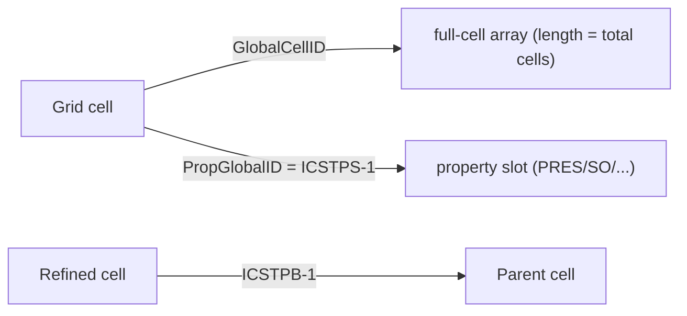

# 数据模型与类型

本页定义各层之间流转的标识符与数组，以及它们所派生的 SR3 数组。

## 两个单元键

属性映射基于**值**与**单元**的刻意分离：

| 键 | 定义 | 索引对象 |
|---|---|---|
| `PropGlobalID` | `ICSTPS - 1` | 空间属性数组（`PRES`、`SO` 等） |
| `GlobalCellID` | SR3 文件中以 0 为基的线性单元索引 | 全单元数组（用于 LGR 聚合） |

`DataMapper` 使用 `PropGlobalID` 进行直接映射（快速，仅适用于叶节点网格），使用 `GlobalCellID` 进行聚合映射（构建全单元数组，通过 `ICSTPB` 将子单元汇总至父单元，再按 `GlobalCellID` 索引）。非活跃单元的 `PropGlobalID == -1`，映射结果为 `NaN`。

## 矩阵网格单元数据

每个矩阵 `UnstructuredGrid` 上附加的数组：

| 数组 | 数据类型 | 含义 |
|---|---|---|
| `PropGlobalID` | int32 | 属性槽索引（`ICSTPS-1`）；`-1` ⇒ 非活跃 |
| `GlobalCellID` | int | 以 0 为基的线性单元索引 |
| `Level` | int16 | LGR 层级（0 = 基础网格） |
| `I`、`J`、`K` | int32 | 该单元所在线段内的局部结构化索引 |
| `ParentI/J/K` | int32 | 父单元的 I/J/K（细化单元）；层级 0 时为 `-1` |

## DFN 单元数据

`build_dfn_segments()` 返回带有以下数据的 QUAD 面：

| 数组 | 含义 |
|---|---|
| `PropGlobalID` | 属性槽（`ISGTPS-1`）——用于将 `PRES`/`SO`/… 映射至线段 |
| `DFNSegmentID` | 原始线段索引 |
| `DFUIndex` | 线段所属的 DFU（`ISGTDU-1`） |
| `HostGlobalCellID` | 承载该线段的矩阵单元（`IPSTCS-1`） |
| `HostI/J/K` | 宿主单元的结构化索引 |
| `SegmentInHost` | 线段在宿主内的序号（`IPSTSG`） |

`build_dfn_units()` 返回原始 DFU 四边形，包含 `DFUIndex`、`DFUNodeEnd`、`DFNIndex`，以及（若存在）`DFUAPT` 和 `DFUPERM`。

## SR3 数组术语表

`SR3Indexer.get_grid_data(step)` 返回包含以下原始数组的字典（具体数组取决于网格类型）：

### 结构与几何

| 数组 | 作用 |
|---|---|
| `IGNTID`、`IGNTJD`、`IGNTKD` | 各线段的 NI、NJ、NK 维度（NRT: "Grid number to no. of I/J/K direction blocks"） |
| `IGNTNC` | 划定线段边界的累积单元计数偏移量。NRT 称为 "Grid number to last block CS index" —— `IGNTNC[g]` 是网格 `g-1` 的 CS 末尾下标（开区间），故 `diff(IGNTNC)` 给出每个子网格的单元数 |
| `IGNTGT` | 每个子网格的类型码（`1=Cartesian`、`2=Radial`、`3=LGR 子网格`、`12=CornerPoint`）。`IGNTGT[0]` 是根网格类型 —— `GridBuilder` 用它自动检测 |
| `BLOCKSIZE` | 每个单元的（Δx, Δy, Δz）；径向网格为（Δr, 弧长, Δz） |
| `BLOCKDEPTH` | 每个单元的中心深度（正值向下） |
| `BLOCKPVOL` | 每个单元的孔隙体积（NRT: "Block pore volume", dim 5 = Property Volume；容纳流体的岩石体积 = bulk × 孔隙度 × NTG） |
| `WELLRADIUS` | 每个径向线段的内径 |
| `KDIR` | 层方向（`UP`/`DOWN`） |

### 单元 ↔ 属性 ↔ 父单元

| 数组 | 作用 |
|---|---|
| `ICSTPS` | 几何单元 → 属性槽（`PropGlobalID = ICSTPS-1`）；NRT: "Complete storage to packed storage" |
| `ICSTPB` | 父指针（1 为基），用于推断 `Level` 并聚合 LGR；NRT: "Complete storage to parent block" |
| `ICSTCG` | `ICSTPB` 的反向：每单元的子网格指针（1 为基），仅在被细化的父单元上非零；NRT: "Complete storage to child grid" |
| `ICSTGN` | 每单元的网格编号（1 为基）；NRT: "Complete storage to grid number" —— 等价于 `1 + np.searchsorted(IGNTNC[1:], np.arange(n), side='right')` |
| `IPSTAC` | 每个属性槽的活跃标志（空层宿主单元可为非活跃）；NRT: "Packed storage to active status" |

### 角点编码

| 数组 | 编码方式 |
|---|---|
| `NODES`、`BLOCKS` | 显式节点 + 连接关系 |
| `XCORNCRCN`、`YCORNCRCN`、`ZCORNCRCN` | 压缩结构化角点 |
| `COORD`、`ZCORN` | Eclipse 风格支柱(pillar)网格 |

### DFN

| 数组 | 作用 |
|---|---|
| `DFUCOX/Y/Z`、`DFUTNL`、`IUTDF` | 原始 DFU 四边形、节点范围、DFN 索引 |
| `SGCORX/Y/Z`、`ISGTPS` | 嵌入线段四边形 + 属性槽 |
| `ISGTDU`、`IPSTCS`、`IPSTSG` | 线段 → DFU、→ 宿主单元、→ 宿主内序号 |

!!! note "活跃单元"
    `active_cell_mask` 同时要求 `ICSTPS > 0` **且** `IPSTAC != 0`。
    仅使用 `ICSTPS` 会将空层宿主单元（DFN 模型中常见）计为活跃，
    导致单元计数相对于 CMG Results 虚高。

## 时间序列数据

`TimeSeries/<entity>/Data` 是按 `(time, variable, origin)` 排列的三维数组。
`SR3Indexer.get_timeseries_data` 将其展平为长格式 DataFrame，列名为
`Entity`、`Origin`、`Variable`、`TimeIndex`、`Time`、`Date`、`Value`、`Unit`。
参见[井与时间序列](../user-guide/concepts/timeseries.md)。
