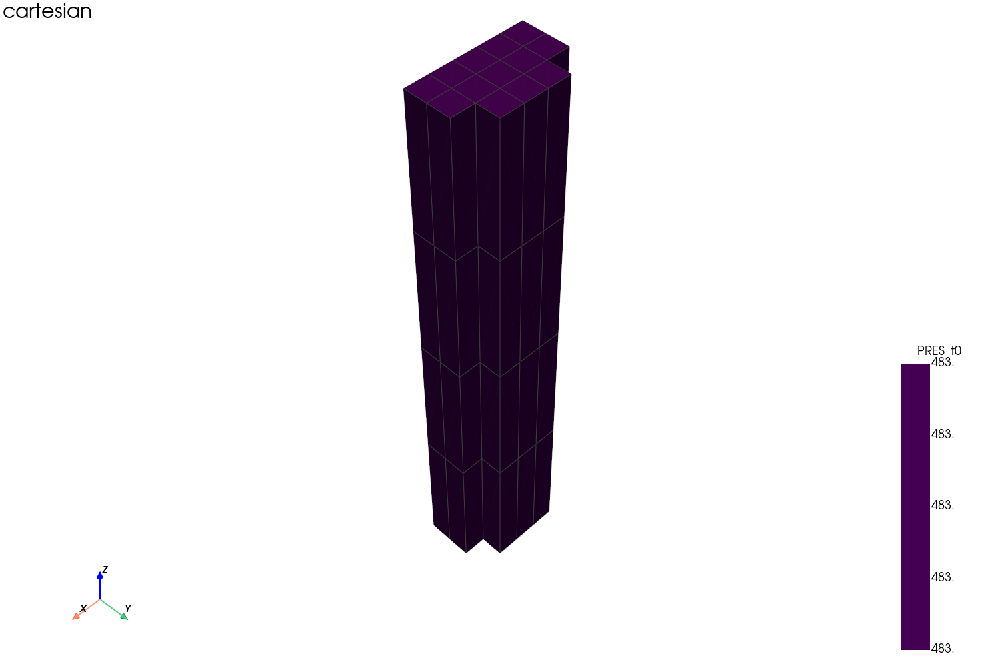
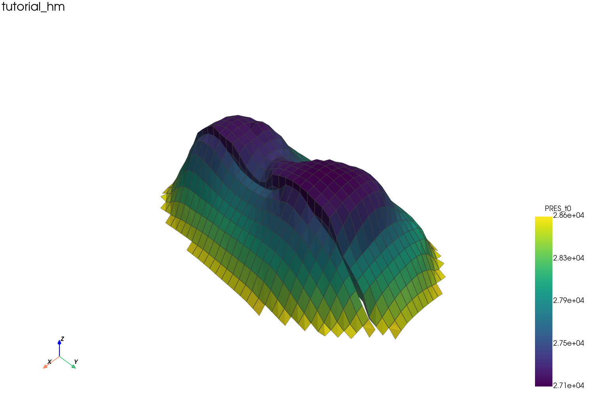
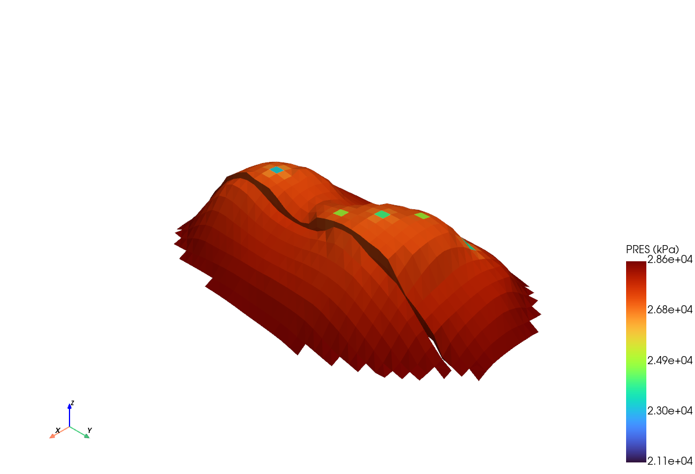

---
hide:
  - navigation
  - toc
---

<section class="hero" markdown>

# pysr3

用于读取 **CMG SR3** 结果文件的第三方 Python 工具包：索引 HDF5 容器、为任意 SR3
网格族构建 PyVista 网格，并将空间属性和时序结果映射到单元与 DataFrame。优先支持 STARS。

<div class="hero-actions" markdown>
[快速开始](user-guide/quickstart.md)
[用户指南](user-guide/index.md){ .secondary }
[API 参考](api/index.md){ .secondary }
</div>

</section>

## 为什么选择 pysr3

<div class="feature-grid" markdown>

<div class="feature-card" markdown>
### :material-file-tree: SR3 读取
单一数据源（`SR3Indexer`）解析元数据、组分、单位、时间步、空间属性和时序——以纯 NumPy
数组形式返回，从不暴露原始 HDF5 句柄。
</div>

<div class="feature-card" markdown>
### :material-grid: 网格构建
每种网格族对应一种策略——笛卡尔/VARI、径向和角点网格——加上 LGR
层级和嵌入式 DFN 曲面，全部生成 PyVista `UnstructuredGrid`。
</div>

<div class="feature-card" markdown>
### :material-palette: 属性映射
通过稳定的单元 ID 将 `PRES`、`SO`、`SG`、`SW`、`TEMP`……映射到网格单元，
支持可选的自底向上 LGR 聚合，以整洁的 DataFrame 形式返回。
</div>

<div class="feature-card" markdown>
### :material-chart-line: 井与时序
以长格式 DataFrame 读取 `WELLS`、`LAYERS`、`GROUPS`、`SECTORS` 和 `SPECIAL HISTORY`，
已针对真实 STARS 2025.20 输出进行验证。
</div>

</div>

## 快速开始

```python
from pysr3 import SR3Indexer, GridBuilder, DataMapper

with SR3Indexer("model.sr3") as sr3:
    grid = GridBuilder(sr3).build(grid_type="CornerPoint", grid_mode="mixed")
    pres = DataMapper(sr3).map_prop(grid, "PRES", time_step=0)
    grid.save("grid.vtu")
```

[阅读完整快速开始 →](user-guide/quickstart.md){ .md-button }

## 探索

<div class="gallery-grid" markdown>

<div class="gallery-card" markdown>

<div markdown>
### [第一个 SR3 案例](user-guide/tutorials/first-sr3-case.md)
打开文件、构建网格、映射 `PRES`。
</div>
</div>

<div class="gallery-card" markdown>

<div markdown>
### [网格可视化](user-guide/tutorials/grid-visualization.md)
导出 VTU、全局/切片渲染、垂向夸大。
</div>
</div>

<div class="gallery-card" markdown>

<div markdown>
### [角点网格与 DFN](user-guide/tutorials/corner-grid.md)
处理 `CornerPoint`、`CONVERT-TO-CORNER-POINT` 和 DFN 曲面。
</div>
</div>

<div class="gallery-card" markdown>

<div markdown>
### [深入：HM 模型](user-guide/tutorials/inspect-hm-model.md)
3D 场景、等值面、过滤、剖面、等值线与时序绘图。
</div>
</div>

</div>

## 下一步

- **[用户指南](user-guide/index.md)** — 安装、构建网格、映射属性、读取井数据。
- **[开发者指南](developer-guide/index.md)** — 架构、数据模型和内部实现。
- **[API 参考](api/index.md)** — 从源码自动生成。
