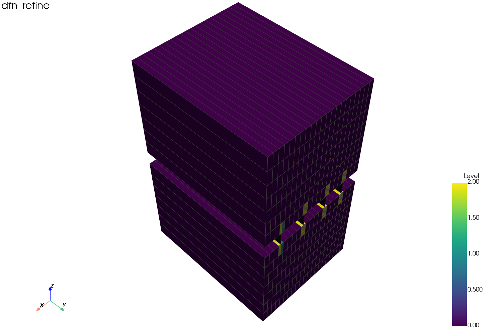

# DFN vs LGR

Both DFN and LGR complicate grid relationships, but they are **different kinds
of object** and pysr3 builds them with different methods.

| | LGR | DFN |
|---|---|---|
| Source keyword | `*REFINE` | `*BEGIN_DFN` |
| Geometric meaning | a parent cell refined into child hexahedra | embedded 2D fracture surfaces |
| SR3 arrays | `IGNTNC` segments + `ICSTPB` parent pointers | `DFUCO*`, `SGCOR*`, `ISGT*` |
| Built with | `GridBuilder.build(..., grid_mode=...)` | `build_dfn_units()`, `build_dfn_segments()` |

**LGR** is volumetric refinement. `mixed` mode keeps unrefined parents and leaf
children so nothing is drawn twice.

**DFN** is a set of 2D fracture surfaces embedded in the matrix grid. It is *not*
a hexahedral filling of a null layer and does not appear in the matrix grid's
level hierarchy.

## Convert-to-corner case

`test/convert_to_corner/convert_to_corner.dat` combines:

```text
*GRID *CART
*CONVERT-TO-CORNER-POINT
*BEGIN_DFN
```

CMG Results reports 315 total matrix blocks, 294 active blocks, and 1 DFN with
2 DFUs. pysr3 reproduces this:

```python
from pysr3 import SR3Indexer, GridBuilder

with SR3Indexer("test/convert_to_corner/convert_to_corner.sr3", eager_list_steps=None) as sr3:
    builder = GridBuilder(sr3)
    matrix       = builder.build("CornerPoint")
    dfn_segments = builder.build_dfn_segments()
    dfn_units    = builder.build_dfn_units()

print(matrix.n_cells)        # 294
print(dfn_segments.n_cells)  # 6
print(dfn_units.n_cells)     # 2
```

The center slice shows the fracture (black) passing through the middle null
layer — a surface, not a volume:


## Multiple DFUs

`test/dfn_multi/dfn_multi.dat` raises the DFU count to 4 with distinct
`*PERM-DF`, `*APER-DF`, and `*POR-DF`:

```text
*BEGIN_DFN 'dfn_multi' CMG 4
  *PERM-DF *ALL 800 1200 1600 2000
  *APER-DF *ALL 0.05 0.08 0.10 0.12
```

pysr3 reads 4 DFUs and 12 active segments, with `DFUAPT = 0.05/0.08/0.10/0.12`
and `DFUPERM = 800/1200/1600/2000`.

## DFN_REFINE

`*DFN_REFINE` automatically generates LGR around the fracture, but the DFN
segments remain independent surfaces:

```text
*DFN_REFINE 'dfn_refine' *MINVOL 100000 *INTO 2 1 2 *MAXLVL 3
```

For `test/dfn_refine/dfn_refine.sr3`: the matrix `mixed` grid has 402 cells
across levels 0/1/2; there are 4 DFUs, 36 active segments, and 60 total
(`include_inactive=True`). That SR3 emits no corner arrays, so `CornerPoint`
falls back to the Cartesian/LGR arrays automatically.



## Key SR3 arrays

**Matrix grid**

- `XCORNCRCN/YCORNCRCN/ZCORNCRCN` — corner coordinates.
- `ICSTPS` — maps a geometry cell to its property slot.
- `IPSTAC` — active flag per property slot. Looking only at `ICSTPS > 0` would
  count null-layer host cells as active; pysr3 also checks `IPSTAC`.

**DFN**

- `DFUCOX/Y/Z`, `DFUTNL`, `IUTDF` — original DFU quads, node ranges, DFN index.
- `SGCORX/Y/Z`, `ISGTPS` — embedded segment quads and their property slots.
- `ISGTDU` — the DFU each segment belongs to.
- `IPSTCS` — the host matrix cell of each segment.

See [Data model & types](../../developer-guide/data-model.md) for the full glossary.

## Visualization tip

Export the matrix grid and the DFN segments separately and overlay them.
`tools/export_case_assets.py` writes, for DFN cases:

```text
grid.vtu  grid_display.vtu
dfn_segments.vtu  dfn_segments_display.vtu  dfn_units.vtu
overview.png  slice.png  summary.json
```
