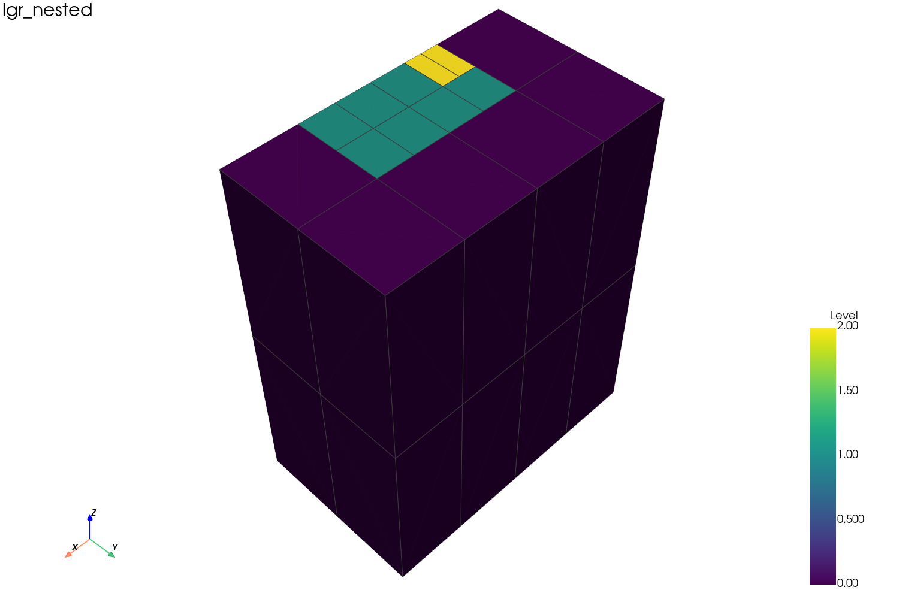

# 网格类型

sr3kit 优先支持 CMG **STARS**。手册中的基础 `*GRID` 类型包括
`*CART`、`*VARI`、`*RADIAL` 和 `*CORNER`。`*REFINE` 是局部网格细化
(LGR)——它是一种修饰符，而非基础类型。

| CMG 关键字 | `grid_type` | 主要 SR3 数组 |
|---|---|---|
| `*GRID *CART` | `Cartesian` | `IGNTID/JD/KD`, `IGNTNC`, `BLOCKSIZE`, `BLOCKDEPTH`, `ICSTPB`, `ICSTPS` |
| `*GRID *VARI` | `Cartesian` | 与 CART 相同（通过 `BLOCKSIZE`/`BLOCKDEPTH` 支持可变尺寸） |
| `*GRID *RADIAL` | `Radial` | `BLOCKSIZE`, `WELLRADIUS`, `IGNTID/JD/KD`, `ICSTPB`, `ICSTPS` |
| `*GRID *CORNER` | `CornerPoint` | 三种角点编码之一（见下文） |

## CART 与 VARI

`*GRID *CART` 是规则笛卡尔网格；`*GRID *VARI` 允许可变单元
尺寸和深度。两者均通过 `BLOCKSIZE` 和 `BLOCKDEPTH` 表达，因此
sr3kit 使用相同策略构建它们：

```python
grid = GridBuilder(sr3).build(grid_type="Cartesian")
```

## RADIAL

`*GRID *RADIAL` 是径向/柱状网格。sr3kit 从 `BLOCKSIZE`（Δr、弧长、Δz）和 `WELLRADIUS` 重建楔形几何，并对宽楔形进行细分，使其渲染为平滑弧线。

```python
grid = GridBuilder(sr3).build(grid_type="Radial")
```

## CORNER

`*GRID *CORNER` 是角点网格。STARS 可以用三种不同方式写入角点几何；sr3kit 自动检测并处理所有格式：

- `NODES` + `BLOCKS` — 显式节点与单元连接关系（由 CMG 预计算）。
- `XCORNCRCN` + `YCORNCRCN` + `ZCORNCRCN` — 压缩结构化角点。
- `COORD` + `ZCORN` — Eclipse 风格支柱网格(pillar grid)。

```python
grid = GridBuilder(sr3).build(grid_type="CornerPoint")
```

### 转换为角点网格

`*CONVERT-TO-CORNER-POINT` 在运行时将笛卡尔型网格转换为角点网格——通常用于处理 `*VARI` 网格中的不匹配角点。生成的 SR3 使用角点几何数组，以 `CornerPoint` 方式构建。

!!! warning "转换的局限性"
    这是运行时转换（DAT 文件不会被重写），不能保留手工构建的断层几何，也不能与某些网格修改关键字（如 `*PINCHOUTARRAY`）组合使用。

## LGR

LGR 来自 `*REFINE`。sr3kit 从父指针（`ICSTPB`）和段偏移（`IGNTNC`）推断每个单元的层级，并通过 `grid_mode`（`mixed`、`refined`、`levelN`）选择显示内容。支持嵌套（多层）细化，并通过 `test/lgr_nested/lgr_nested.sr3` 进行验证，其 `mixed` 网格在 0/1/2 层级上共保留 36 个叶子单元。



显示模式详见[网格构建](../grid-building.md)，DFN 单独处理的原因详见 [DFN vs LGR](dfn-vs-lgr.md)。
