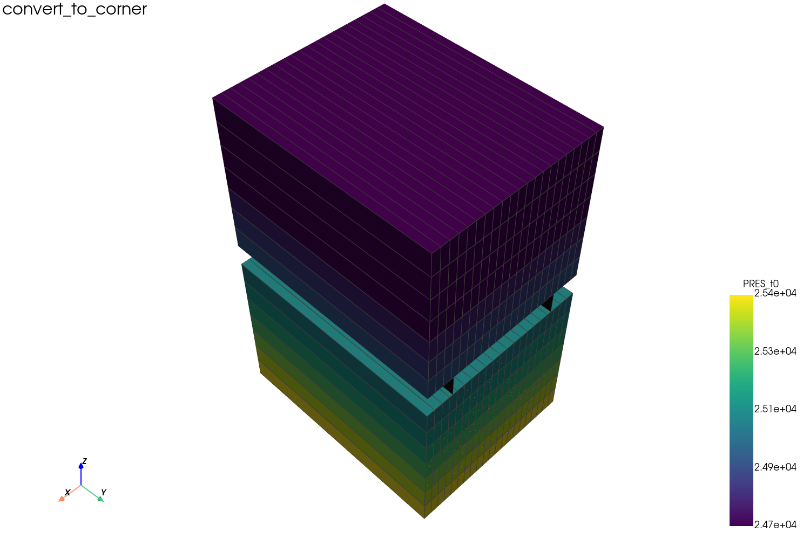
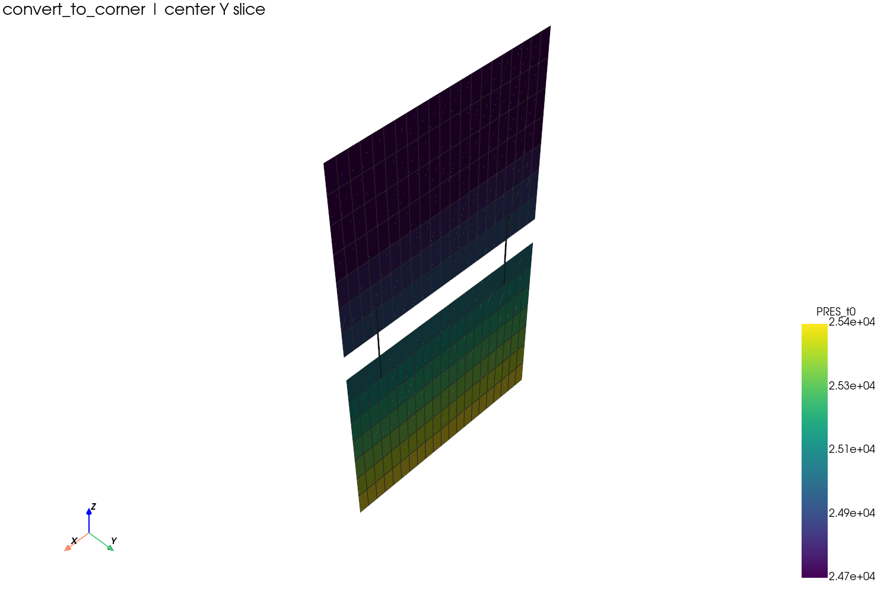

# Corner-point grids

## Goal

Understand `CornerPoint` grids, Z-direction display, and the
`*CONVERT-TO-CORNER-POINT` case that also contains a DFN.

## Read a corner-point grid

```python
from pysr3 import SR3Indexer, GridBuilder

with SR3Indexer("test/convert_to_corner/convert_to_corner.sr3") as sr3:
    grid = GridBuilder(sr3).build(grid_type="CornerPoint")

print(grid.n_cells)
```

## The convert-to-corner case

This case comes from a STARS template whose DAT file contains:

```text
*GRID *CART
*CONVERT-TO-CORNER-POINT
*BEGIN_DFN
```

The SR3 emits corner geometry for the matrix grid (built as `CornerPoint`). The
DFN is a separate set of embedded fracture surfaces — not an LGR.



## Center slice



The vertical black surface is a DFN segment. It passes through the middle null
layer but is **not** a volumetric filling of that layer.

## Read the DFN

```python
from pysr3 import SR3Indexer, GridBuilder, DataMapper

with SR3Indexer("test/convert_to_corner/convert_to_corner.sr3", eager_list_steps=None) as sr3:
    builder = GridBuilder(sr3)
    matrix       = builder.build("CornerPoint")
    dfn_segments = builder.build_dfn_segments()
    dfn_units    = builder.build_dfn_units()
    pressure     = DataMapper(sr3).map_prop(dfn_segments, "PRES", 0)

print(matrix.n_cells)        # 294
print(dfn_segments.n_cells)  # 6
print(dfn_units.n_cells)     # 2
```

## Note on Z

Most corner-point SR3 files store Z as depth (increasing downward), so the
exporter uses `depth-up` display by default for corner cases. See
[DFN vs LGR](../concepts/dfn-vs-lgr.md) and
[Coordinate system](../concepts/coordinate-system.md).
