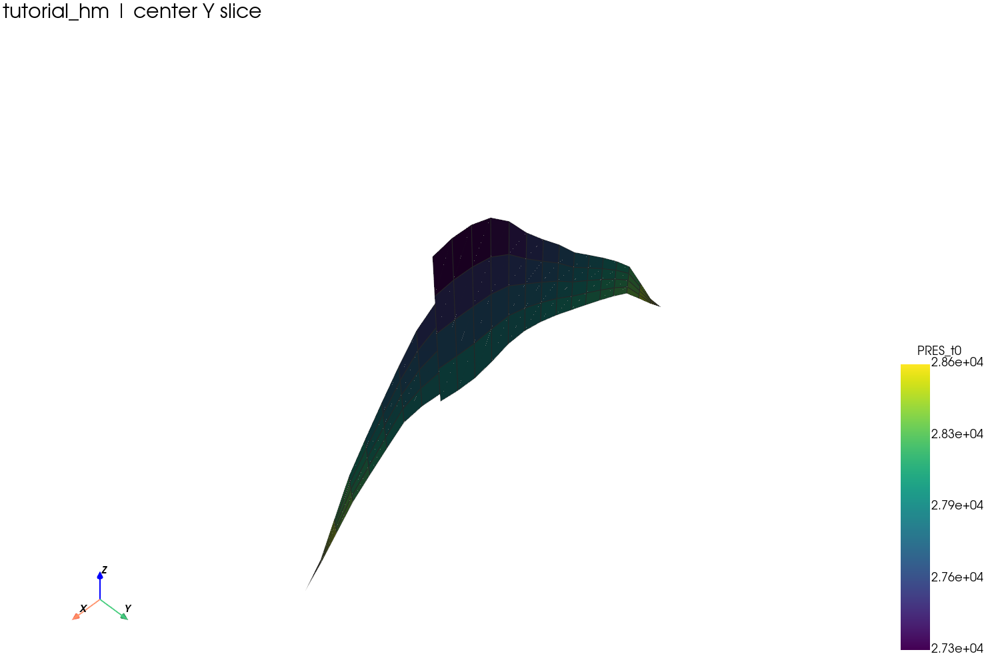

# 网格可视化

## 目标

为某个案例导出 VTU 网格、整体图渲染及中心切片，并对薄储层模型应用垂向夸张。

## 导出资产

```bash
python tools/export_case_assets.py --case tutorial_hm --scale-z 10
```

输出目录：

```text
test/50the_datafile/artifacts/
  grid.vtu
  grid_display.vtu
  overview.png
  slice.png
  summary.json
```

## 整体图


## 中心切片



## 原理说明

`grid.vtu` 保存核心构建坐标；`grid_display.vtu` 为显示坐标副本，
可能翻转 Z 轴并应用比例夸张。薄储层通常需要垂向夸张才便于阅读 —— 参见
[坐标系与显示比例](../concepts/coordinate-system.md)。

若要通过 PyVista 以编程方式完成相同操作：

```python
from pysr3 import SR3Indexer, GridBuilder

with SR3Indexer("test/50the_datafile/tutorial_hm.sr3", eager_list_steps=None) as sr3:
    grid = GridBuilder(sr3).build(grid_type="CornerPoint")

grid.save("grid.vtu")
grid.plot(show_edges=True)   # set pyvista.OFF_SCREEN = True on a headless host
```
