# 深入探索：历史拟合模型

本文是围绕一个真实 STARS 模型
`test/50the_datafile/tutorial_hm.sr3` 构建的完整实践教程——一个角点历史拟合案例。我们将从打开文件开始，逐步完成三维场景、等值面、过滤、剖面/切片、等值线以及时序绘图，所有代码片段均可直接运行。

!!! info "关于本数据集"
    一个 `CornerPoint` 网格，共 **2616 个单元**（I 2–24，J 1–33，K 0–3），覆盖 **8 个输出时间步**（0–约 300 天）。空间属性包括 `PRES`、`TEMP`、`SO`、`SG`、`SW`；十口井（`Well 1` … `Well 10`）报告 `OILRATSC`、`BHP` 等数据。

所有三维渲染使用 [PyVista](https://docs.pyvista.org/)；时序图使用 Matplotlib。在无显示环境的服务器上，请先设置 `pyvista.OFF_SCREEN = True`（参见[安装说明](../installation.md#headless--server-rendering)）。

## 1. 打开文件并查看内容

```python
from sr3kit import SR3Indexer, GridBuilder, DataMapper

SR3 = "test/50the_datafile/tutorial_hm.sr3"

with SR3Indexer(SR3, eager_list_steps=None) as sr3:
    time_steps = sr3.get_spatial_time_steps()                 # [0, 9, 26, 30, 34, 37, 40, 43]
    print("times (days):", [round(sr3.get_time_offset(t), 1) for t in time_steps])
    print("grid steps:", sr3.get_grid_time_steps())   # [0]
    print("properties @ t0:", sr3.get_available_properties(0))
    print("time-series entities:", sr3.get_timeseries_entities())
    print("wells:", [o for o in sr3.get_timeseries_info("WELLS")["origins"] if o])
```

示例输出（注意 `Well 5` 在本数据集中不存在）：

```text
times (days): [0.0, 1.0, 60.0, 91.0, 121.0, 152.0, 182.0, 213.0]
grid steps: [0]
properties @ t0: ['MODBVOL', 'PERMI', 'PERMJ', 'PERMK', 'POROS', 'PRES', 'SG', 'SO', 'SW', 'TEMP']
time-series entities: ['GROUPS', 'LAYERS', 'SECTORS', 'WELLS']
wells: ['Well 1', 'Well 10', 'Well 2', 'Well 3', 'Well 4', 'Well 6', 'Well 7', 'Well 8', 'Well 9']
```

`get_spatial_time_steps()` 返回 SR3 步骤索引；`get_time_offset()` 将步骤转换为经过的天数。网格几何仅在步骤 0 写入——这是正常现象，后续任意时间步的属性映射会自动复用该几何。

## 2. 构建网格并附加属性

`GridBuilder` 生成网格；`DataMapper` 将属性映射到单元上。映射后的列可直接写入 `grid.cell_data`：

```python
import numpy as np

with SR3Indexer(SR3, eager_list_steps=None) as sr3:
    grid = GridBuilder(sr3).build(grid_type="CornerPoint")
    mapper = DataMapper(sr3)

    last = sr3.get_spatial_time_steps()[-1]
    grid.cell_data["PRES"] = mapper.map_prop(grid, "PRES", last).iloc[:, 0].to_numpy()

    print(grid.n_cells, "cells")
    print("PRES range:", np.nanmin(grid.cell_data["PRES"]), np.nanmax(grid.cell_data["PRES"]))
```

```text
2616 cells
PRES range: 21073.6 28643.4
```

!!! tip "`.iloc[:, 0]`"
    `map_prop` 返回带标签的 DataFrame（每个关键字×时间对应一列）。对于单个关键字/时间步，`.iloc[:, 0].to_numpy()` 即为单元数组。

## 3. 垂向夸张与 depth-up 显示

该模型以**深度**形式存储 Z 值（正值，约 3000 m；横向约 4 km，而厚度仅约 180 m）——在真实比例下看起来像一张平板，因此三维场景通常会对垂向进行夸张，并翻转深度使浅部朝上。

最简单的原生方式是 **`Plotter.set_scale`**，它只缩放*视图*。数据仍保持真实坐标，因此切片、映射和导出都不受影响——无需复制，也无需改写点数组：

```python
plotter.add_mesh(grid, scalars="PRES", cmap="turbo")
plotter.set_scale(zscale=8)                      # 8x vertical exaggeration (display only)

# each axis scales independently; a negative value flips that axis,
# so a negative zscale turns positive-down depth into "up":
plotter.set_scale(xscale=1, yscale=1, zscale=-8)
```

同一属性在真实比例（平坦）→ 中等夸张 → 强夸张下的对比：

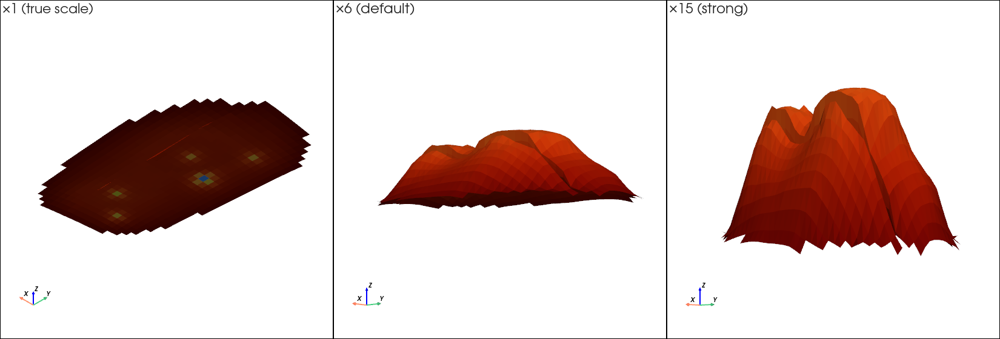

如果只是想*查看*网格，`set_scale` 已足够。下文有几节还会**切片和绘制等值线**，因此会构建一份显示副本——同样使用 PyVista 的原生缩放（`scale` + `flip_z`），而非手动改写点坐标：

```python
def display_grid(grid, exaggerate=6.0):
    """Depth-up, vertically exaggerated copy — for display only, not for math."""
    return grid.scale((1, 1, exaggerate), inplace=False).flip_z(inplace=False)

disp = display_grid(grid)
```

详见[坐标系与显示比例](../concepts/coordinate-system.md)中的原理说明。

## 4. 三维绘图

```python
import pyvista as pv
# pv.OFF_SCREEN = True   # uncomment on a headless server

plotter = pv.Plotter(window_size=(1200, 820))
plotter.set_background("white")
plotter.add_mesh(
    grid,
    scalars="PRES",
    cmap="turbo",
    scalar_bar_args={"title": "PRES (kPa)", "vertical": True},
)
plotter.set_scale(zscale=-8)       # depth-up + 8x exaggeration (display only)
plotter.add_axes()
plotter.camera_position = "iso"
plotter.show()                     # or: plotter.screenshot("pres_3d.png")
```


背斜（穹隆状）构造清晰可见，中部有一条断层错断。

## 5. 属性与时间步选择

选择*哪个*属性以及*哪个*时间步。使用数据发现接口来驱动选择：

```python
with SR3Indexer(SR3, eager_list_steps=None) as sr3:
    grid = GridBuilder(sr3).build(grid_type="CornerPoint")
    mapper = DataMapper(sr3)

    # one property at several times -> a multi-column DataFrame
    df = mapper.map_prop(grid, "SO", sr3.get_spatial_time_steps())
    print(df.columns.names)        # ['Keyword','LongName','Unit','Time','TimeIndex','TimeUnit']
    print(df.columns.get_level_values("Time"))   # elapsed days per column

    # several properties at one time
    df2 = mapper.map_prop(grid, ["PRES", "TEMP", "SW"], sr3.get_spatial_time_steps()[-1])
```

```text
['Keyword', 'LongName', 'Unit', 'Time', 'TimeIndex', 'TimeUnit']
[0.0, 1.0, 60.0, 91.0, 121.0, 152.0, 182.0, 213.0]
```

若要按*经过天数*而非步骤索引来选择，可查找最近的时间步：

```python
def step_nearest_days(sr3, target_days):
    steps = sr3.get_spatial_time_steps()
    return min(steps, key=lambda s: abs(sr3.get_time_offset(s) - target_days))

step = step_nearest_days(sr3, 150)     # closest step to day 150
```

DataFrame 列中同时携带单位信息——便于用作坐标轴标签：

```python
unit = df.columns.get_level_values("Unit")[0]
```

## 6. 配色/色图选择

`cmap` 接受任意 Matplotlib 色图。按数据类型选择：

| 数据类型 | 推荐色图 |
|---|---|
| 顺序型（PRES、SO、TEMP） | `viridis`、`turbo`、`inferno`、`magma`、`cividis` |
| 发散型（变化量、残差） | `coolwarm`、`RdBu_r`、`Spectral_r` |
| 分类型（`Level`、`K`） | `Set2`、`tab10`（配合 `n_colors`） |

同一 `PRES` 字段在三种色图下的效果——`viridis`、`coolwarm`、`cividis`（仅修改 `cmap=` 即可）：

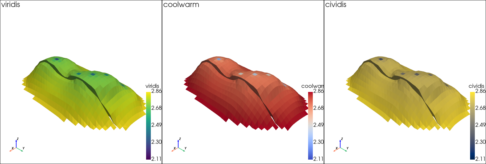

固定色彩范围并设置超出范围及缺失值的样式：

```python
plotter.add_mesh(
    disp,
    scalars="PRES",
    cmap="cividis",
    clim=(21000, 28700),       # fixed color range (consistent across times)
    below_color="navy",         # values < clim[0]
    above_color="red",          # values > clim[1]
    nan_color="#dddddd",        # inactive / unmapped cells
    n_colors=12,                # discrete bands instead of a smooth ramp
)
```

!!! tip
    对比多个时间步时，在每一帧上设置相同的 `clim`，以确保颜色含义一致。

## 7. 等值面

等值面需要*点*数据，因此需先将单元数据转换为点数据，再进行等值面提取：

```python
point_grid = disp.cell_data_to_point_data()
iso = point_grid.contour(isosurfaces=6, scalars="PRES")   # 6 evenly spaced levels
# explicit levels: point_grid.contour(isosurfaces=[22000, 25000, 28000], scalars="PRES")

plotter = pv.Plotter()
plotter.add_mesh(disp, color="#cccccc", opacity=0.12)     # faint shell for context
plotter.add_mesh(iso, scalars="PRES", cmap="turbo")
plotter.show()
```

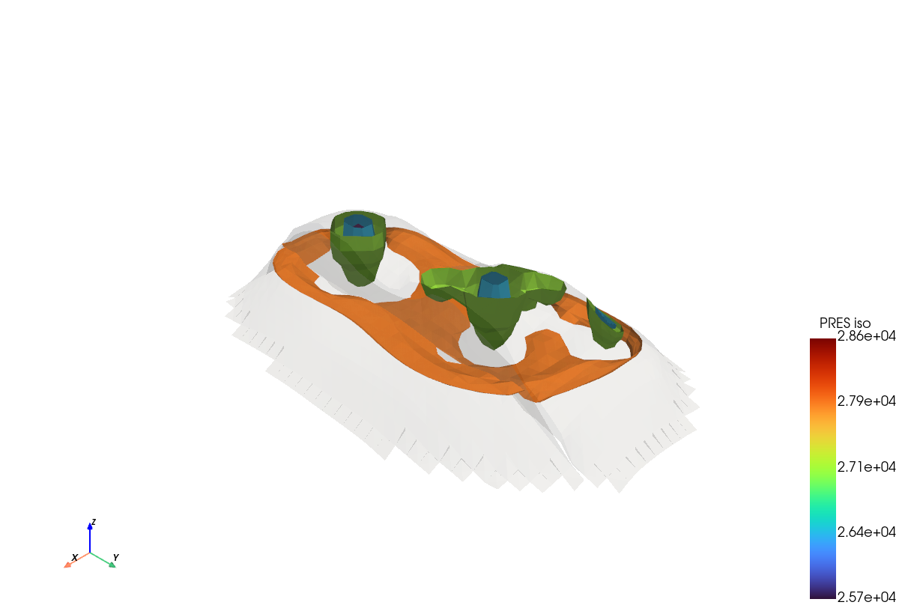

### 选择层数/级数

`isosurfaces=N` 生成 N 个等间距层级（也可传入显式数值列表）。层数越多，结构细节越丰富，但视图也会越复杂——以下为同一字段 3、6 和 12 层的效果：

```python
for n in (3, 6, 12):
    iso_n = point_grid.contour(isosurfaces=n, scalars="PRES")
    # ... render each into its own subplot or figure
```

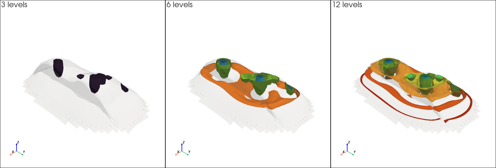

### 透明度

较低的 `opacity` 值可透视内部嵌套曲面及其背后的结构。对比 `opacity` 为 0.3、0.6 和 1.0 的效果：

```python
iso = point_grid.contour(isosurfaces=6, scalars="PRES")
plotter.add_mesh(iso, scalars="PRES", cmap="turbo", opacity=0.3)   # try 0.3 / 0.6 / 1.0
```

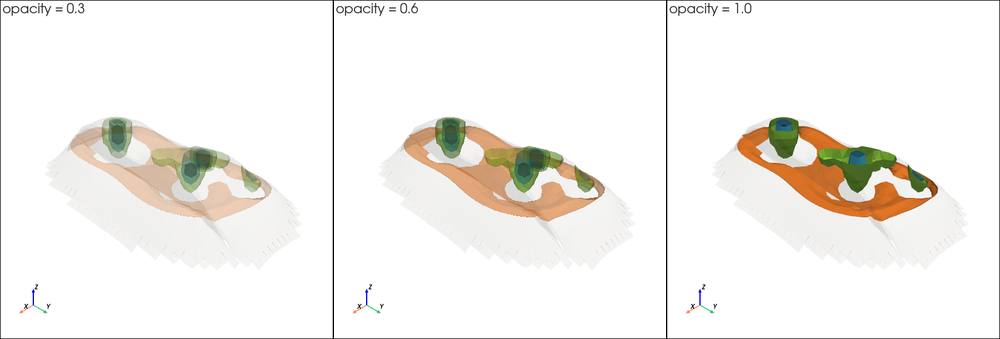

## 8. 属性过滤

`threshold` 保留标量值在指定范围内的单元——例如富油单元：

```python
disp.cell_data["SO"] = mapper.map_prop(grid, "SO", last).iloc[:, 0].to_numpy()

so_q = np.nanpercentile(disp.cell_data["SO"], 75)
oil_rich = disp.threshold(value=so_q, scalars="SO")        # SO >= 75th percentile
# a window instead: disp.threshold(value=(0.69, 0.72), scalars="SO")

plotter = pv.Plotter(shape=(1, 3))                 # three viewpoints
for col, view in enumerate(["iso", "xy", "yz"]):
    plotter.subplot(0, col)
    plotter.add_mesh(disp, color="#e2e2e2", opacity=0.07)   # faint context
    plotter.add_mesh(oil_rich, color="#ea580c")             # solid highlight
    plotter.camera_position = view
plotter.show()
```

此处 `SO` 仅在约 0.67–0.72 之间变化，因此纯色高亮比色图更直观；若要按数值着色，可传入 `scalars="SO", clim=(0.67, 0.72)`。高 `SO` 区域从三个视角展示——等轴视图、俯视图和侧视图——因为单一视角无法判断富油区是位于背斜顶部还是翼部：

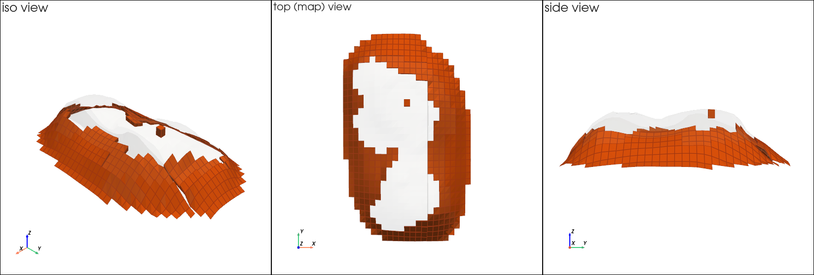

## 9. 坐标与索引过滤

按**结构化索引**（`I`/`J`/`K` 单元数组）或**空间范围**进行过滤：

```python
# top layer only (K == 0)
top_layer = disp.threshold(value=(0, 0), scalars="K")

# a spatial sub-box (xmin,xmax, ymin,ymax, zmin,zmax) — here the western half
xmin, xmax, ymin, ymax, zmin, zmax = disp.bounds
west = disp.clip_box((xmin, (xmin + xmax) / 2, ymin, ymax, zmin, zmax), invert=False)

# cut with an arbitrary plane (keep the +Y side)
north = disp.clip(normal="y", origin=disp.center, invert=False)

plotter = pv.Plotter(shape=(1, 3))                  # the top layer, three views
for col, view in enumerate(["iso", "xy", "xz"]):
    plotter.subplot(0, col)
    plotter.add_mesh(top_layer, scalars="PRES", cmap="turbo", show_edges=True)
    plotter.camera_position = view
plotter.show()
```

提取的顶层（K=0）从三个视角展示——等轴视图、俯视图和正视图：

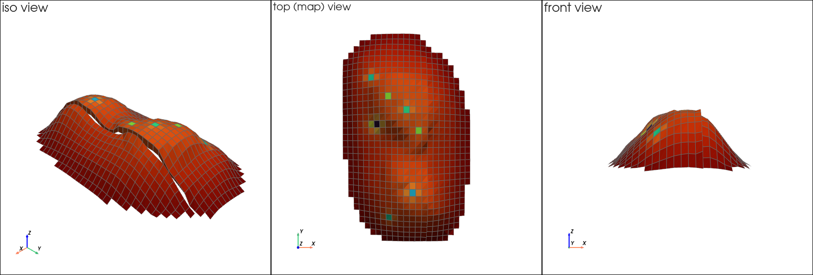

!!! note
    对 `I`/`J`/`K` 使用 `threshold` 可选取逻辑层位；`clip_box`/`clip` 按真实坐标裁剪。两者可自由组合（例如先按层位过滤，再按区域裁剪）。

## 10. 二维剖面/切片

`slice` 用平面切割网格：

```python
sx = disp.slice(normal="x", origin=disp.center)   # a YZ cross-section
sy = disp.slice(normal="y", origin=disp.center)   # an XZ cross-section
three = disp.slice_orthogonal()                    # X, Y and Z planes at once

plotter = pv.Plotter()
plotter.add_mesh(sx, scalars="PRES", cmap="turbo", show_edges=True)
plotter.camera_position = "yz"
plotter.show()
```

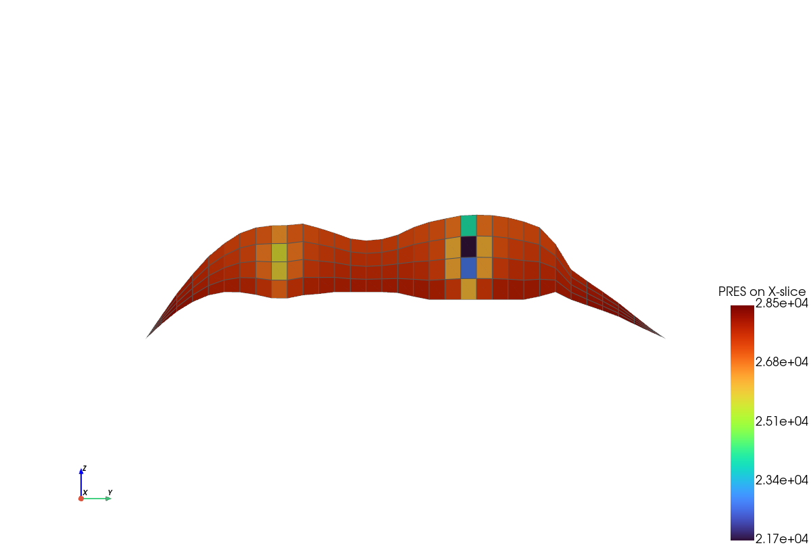

## 11. 等值线

对**剖面**的点数据进行等值线提取，在截面上绘制等压线：

```python
section = disp.slice(normal="x", origin=disp.center)
lines = section.cell_data_to_point_data().contour(isosurfaces=14, scalars="PRES")

plotter = pv.Plotter()
plotter.add_mesh(section, color="#efeae0")                  # neutral backdrop
plotter.add_mesh(lines, scalars="PRES", cmap="turbo", line_width=3)
plotter.camera_position = "yz"
plotter.show()
```

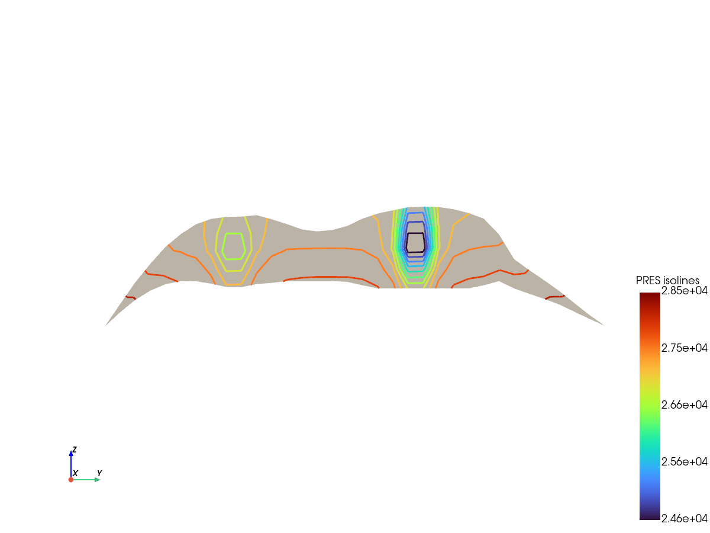

若要绘制经典等值线图，可将同一组等值线叠加在剖面的**填充色图**上，而非中性背景：

```python
plotter = pv.Plotter()
plotter.add_mesh(section, scalars="PRES", cmap="viridis")   # filled background
plotter.add_mesh(lines, color="black", line_width=1.5)      # isolines on top
plotter.camera_position = "yz"
plotter.show()
```

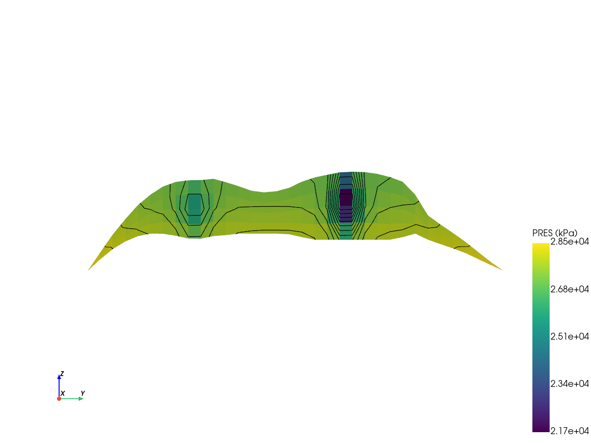

## 12. 某坐标点的时间变化

找到距目标坐标 `(x, y, z)` 最近的单元，然后读取该单元在所有时间步的某一属性值。由于 `map_prop` 以时间为列，**DataFrame 的某一行即为该点的时序数据**：

```python
import matplotlib.pyplot as plt

with SR3Indexer(SR3, eager_list_steps=None) as sr3:
    grid = GridBuilder(sr3).build(grid_type="CornerPoint")
    mapper = DataMapper(sr3)

    centers = grid.cell_centers().points
    target = np.array([1500.0, 2000.0, grid.bounds[4]])      # x, y, near-top
    cell = int(np.argmin(np.linalg.norm(centers - target, axis=1)))
    ijk = (grid.cell_data["I"][cell], grid.cell_data["J"][cell], grid.cell_data["K"][cell])

    df = mapper.map_prop(grid, "PRES", sr3.get_spatial_time_steps())
    series = df.iloc[cell]
    days = df.columns.get_level_values("Time").astype(float).to_numpy()
    order = np.argsort(days)

    plt.plot(days[order], series.to_numpy()[order], marker="o")
    plt.xlabel("Time (days)"); plt.ylabel("PRES (kPa)")
    plt.title(f"PRES at cell I/J/K = {tuple(int(x) for x in ijk)}")
    plt.show()
```

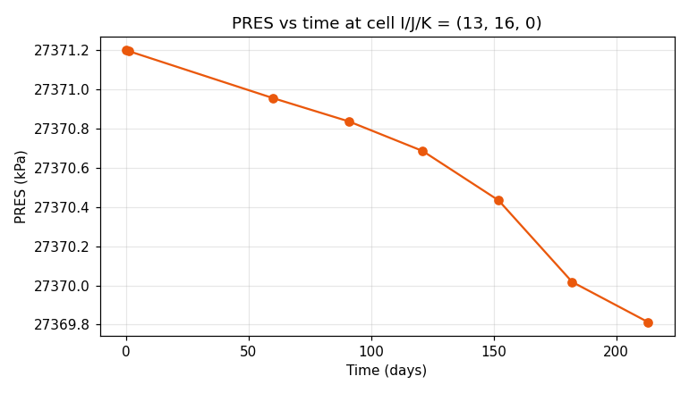

**垂向剖面**（固定 I、J，沿列深度方向的属性分布）思路相同，只是沿单元轴而非时间轴进行：

```python
last = sr3.get_spatial_time_steps()[-1]
col = mapper.map_prop(grid, "PRES", last)        # one time
ij = (grid.cell_data["I"] == 13) & (grid.cell_data["J"] == 16)
order = np.argsort(grid.cell_data["K"][ij])
plt.plot(col.iloc[:, 0].to_numpy()[ij][order], grid.cell_data["K"][ij][order], marker="o")
plt.gca().invert_yaxis(); plt.xlabel("PRES (kPa)"); plt.ylabel("layer K")
```

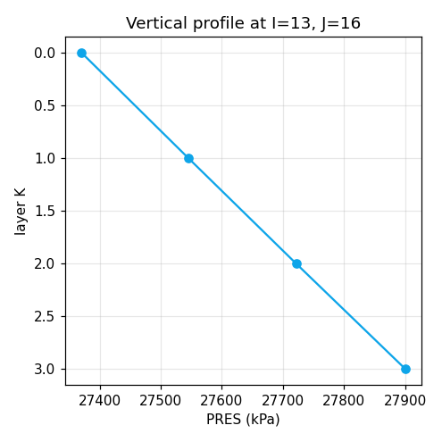

## 13. 井及其他时序数据

`get_well_data` 返回整洁的 DataFrame；循环遍历各井进行对比：

```python
import matplotlib.pyplot as plt

with SR3Indexer(SR3) as sr3:
    for well in ["Well 1", "Well 2", "Well 3"]:
        d = sr3.get_well_data(wells=[well], variables=["OILRATSC"])
        plt.plot(d["Time"], d["Value"], marker="o", label=well)
    plt.xlabel("Time (days)"); plt.ylabel("Oil rate (OILRATSC)")
    plt.legend(); plt.show()
```

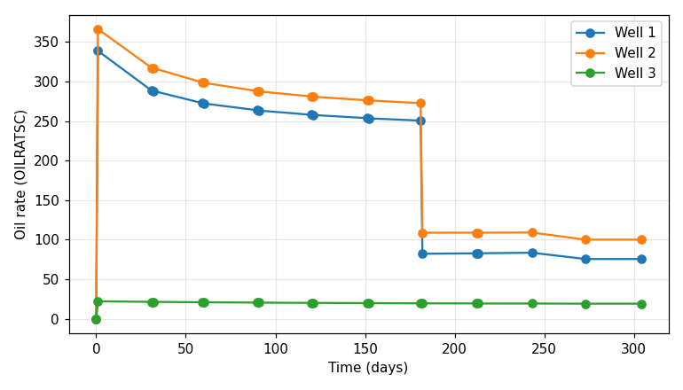

更换变量即可绘制井所报告的任意数据——例如井底压力：

```python
with SR3Indexer(SR3) as sr3:
    for well in ["Well 1", "Well 2", "Well 3"]:
        d = sr3.get_well_data(wells=[well], variables=["BHP"])
        plt.plot(d["Time"], d["Value"], marker="o", label=well)
    plt.xlabel("Time (days)"); plt.ylabel("BHP"); plt.legend(); plt.show()
```

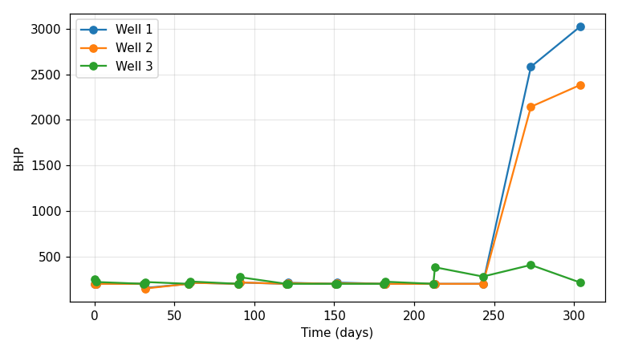

同样的 `get_timeseries_data` 适用于其他实体和变量：

```python
with SR3Indexer(SR3) as sr3:
    bhp   = sr3.get_well_data(variables=["BHP"])                 # all wells, BHP
    layer = sr3.get_timeseries_data(entity="LAYERS", variables=["OILVOLSC"])
    field = sr3.get_timeseries_data(entity="GROUPS")                 # field/group totals

# cumulative oil for one well
w1 = sr3.get_well_data(wells=["Well 1"], variables=["OILVOLSC"])
```

参见[井与时序数据](../concepts/timeseries.md)，了解实体模型和输出列说明。

## 14. 保存结果

所有输出均为标准 PyVista / pandas 格式，导出只需一次调用：

```python
disp.save("hm_display.vtu")               # open in ParaView
grid.save("hm_build.vtu")                 # build coordinates (for math)
df.to_csv("pres_timeseries.csv")          # the mapped DataFrame
plotter.screenshot("scene.png")           # any rendered scene
```

要为本案例重新生成标准资源包（总览图、切片图、摘要）：

```bash
python tools/export_case_assets.py --case tutorial_hm --scale-z 10
```

## 15. 进阶用法

以下示例均复用上述各节中的 `sr3`、`grid`、`mapper`、`disp` 和 `time_steps` 对象。

### 两个时间步之间的差值图

将两个时间快照相减以观察*变化*，并使用以零为中心的**发散色图**展示——此处为从第一步到最后一步的压降：

```python
pres0 = mapper.map_prop(grid, "PRES", time_steps[0]).iloc[:, 0].to_numpy()
presL = mapper.map_prop(grid, "PRES", time_steps[-1]).iloc[:, 0].to_numpy()
disp.cell_data["dPRES"] = presL - pres0

m = np.nanmax(np.abs(disp.cell_data["dPRES"]))      # symmetric range about 0
plotter = pv.Plotter()
plotter.add_mesh(disp, scalars="dPRES", cmap="RdBu_r", clim=(-m, m),
                 scalar_bar_args={"title": "dPRES (last - first)", "vertical": True})
plotter.camera_position = "iso"
plotter.show()
```

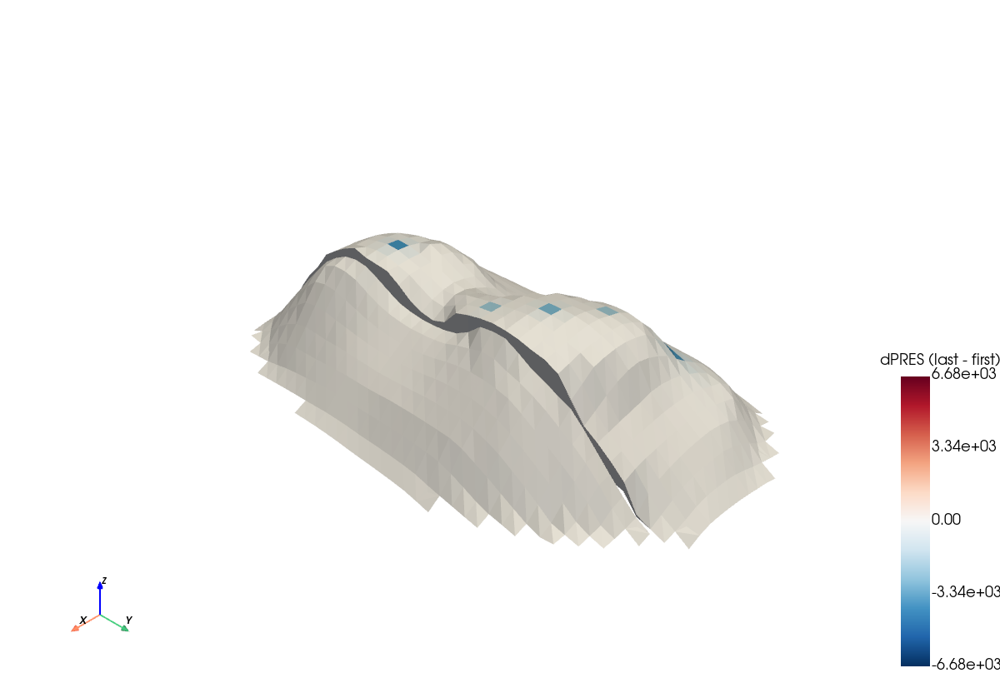

整体而言储层压力变化不大，但井周围的单元压降明显（深蓝色）——这正是发散色图的适用场景。

### 动画：属性随时间变化

每个时间步写入一帧 GIF。在所有帧上固定 `clim` 以保证颜色可比，并**原地**修改标量缓冲区，使同一 actor 得到更新：

```python
lo = min(mapper.map_prop(grid, "PRES", t).iloc[:, 0].min() for t in time_steps)
hi = max(mapper.map_prop(grid, "PRES", t).iloc[:, 0].max() for t in time_steps)

disp.cell_data["PRES"] = mapper.map_prop(grid, "PRES", time_steps[0]).iloc[:, 0].to_numpy()
pres = disp.cell_data["PRES"]                       # mutate this buffer in place

plotter = pv.Plotter(off_screen=True)               # off-screen for GIF capture
plotter.add_mesh(disp, scalars="PRES", cmap="turbo", clim=(lo, hi))
plotter.camera_position = "iso"
plotter.open_gif("pres_over_time.gif", fps=2)
for t in time_steps:
    pres[:] = mapper.map_prop(grid, "PRES", t).iloc[:, 0].to_numpy()
    plotter.add_text(f"day {sr3.get_time_offset(t):.0f}", name="day")
    plotter.write_frame()
plotter.close()
```

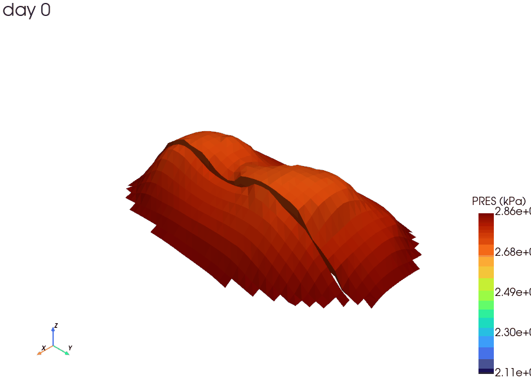

### 属性分布/直方图

对映射值绘制直方图只需一行——在设置 `clim` 之前，可用于快速了解数据范围和离群值：

```python
import matplotlib.pyplot as plt
plt.hist(presL[np.isfinite(presL)], bins=30)
plt.xlabel("PRES (kPa)"); plt.ylabel("cell count"); plt.show()
```

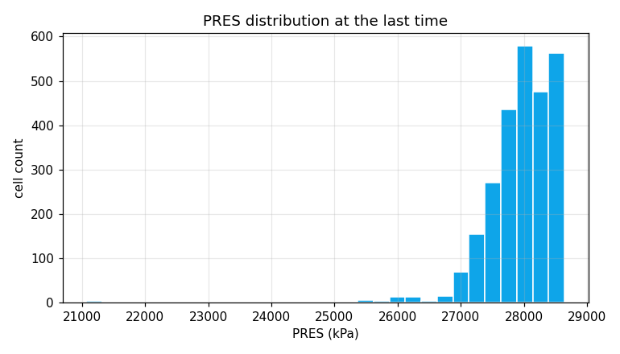

### 体积加权全场平均

合理的区域平均压力需以每个单元的体积为权重。`MODBVOL` 是静态属性（仅在步骤 0 写入），因此只需读取一次权重并重复使用：

```python
bv = mapper.map_prop(grid, "MODBVOL", time_steps[0]).iloc[:, 0].to_numpy()   # static weights

days, avg = [], []
for t in time_steps:
    p = mapper.map_prop(grid, "PRES", t).iloc[:, 0].to_numpy()
    ok = np.isfinite(p) & np.isfinite(bv)
    days.append(sr3.get_time_offset(t))
    avg.append(np.sum(p[ok] * bv[ok]) / np.sum(bv[ok]))

plt.plot(days, avg, marker="o")
plt.xlabel("Time (days)"); plt.ylabel("Volume-weighted mean PRES (kPa)"); plt.show()
```

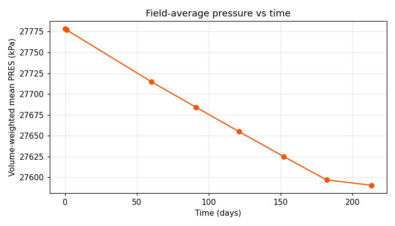

## 小结

| 任务 | 关键调用 |
|---|---|
| 读取与发现 | `SR3Indexer`、`get_spatial_time_steps/properties`、`get_timeseries_*` |
| 构建与映射 | `GridBuilder.build`、`DataMapper.map_prop` |
| 三维场景 | `pv.Plotter().add_mesh(scalars=..., cmap=...)` |
| 等值面 | `cell_data_to_point_data().contour(isosurfaces=...)` |
| 属性过滤 | `grid.threshold(value=..., scalars=...)` |
| 坐标过滤 | `grid.clip_box(...)`、`grid.clip(...)`、对 `I/J/K` 使用 threshold |
| 剖面/切片 | `grid.slice(normal=..., origin=...)` |
| 等值线 | `slice(...).cell_data_to_point_data().contour(...)` |
| 点时序 | `map_prop(grid, kw, all_time_steps).iloc[cell]` |
| 井时序 | `get_well_data(...)`、`get_timeseries_data(...)` |
| 差值图 | 两时间步属性映射相减，使用发散 `cmap` 加对称 `clim` |
| 动画 | `Plotter.open_gif(...)` + 每步调用 `write_frame()` |
| 分布/直方图 | `plt.hist(map_prop(...))` |
| 全场平均 | 使用静态 `MODBVOL` 进行体积加权均值计算 |
