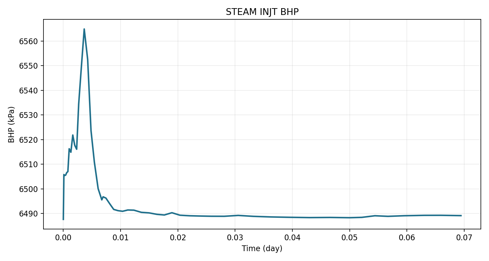

# Well time series

## Goal

Read well time-series results, export them to CSV, and plot a BHP curve.

## Read one well's BHP

```python
from pysr3 import SR3Indexer

with SR3Indexer("test/cartesian/cartesian.sr3") as sr3:
    df = sr3.get_well_data(well_names=["STEAM INJT"], variable_names=["BHP"])

print(df.head())
```

## Export to CSV

```bash
python tools/export_timeseries_assets.py --case cartesian --entity WELLS
```

Output:

```text
test/cartesian/timeseries/wells.csv
```

## Plot a curve

```python
import matplotlib.pyplot as plt
from pysr3 import SR3Indexer

with SR3Indexer("test/cartesian/cartesian.sr3") as sr3:
    df = sr3.get_well_data(well_names=["STEAM INJT"], variable_names=["BHP"])

plt.plot(df["Time"], df["Value"])
plt.xlabel("Time")
plt.ylabel(f"BHP [{df['Unit'].iloc[0]}]")
plt.tight_layout()
plt.savefig("well_bhp_curve.png", dpi=120)
```



## How it works

STARS SR3 stores time-series data with axis order `(time, variable, origin)`.
`get_well_data` reads that order and returns a long-form DataFrame with one row
per (time, well, variable). See [Wells & time series](../concepts/timeseries.md).
